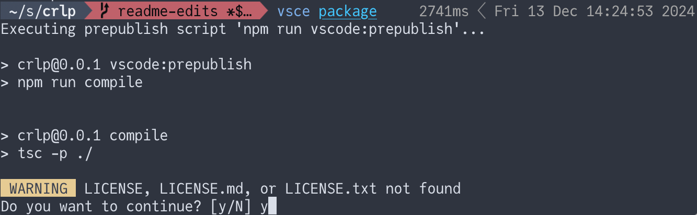
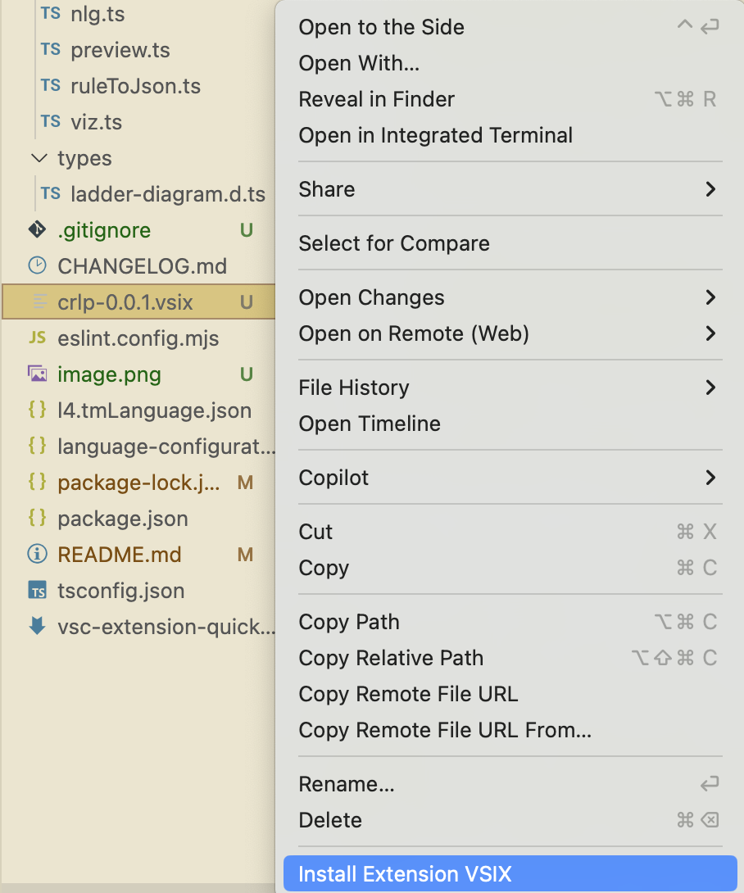
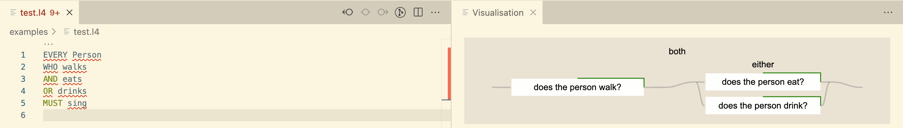
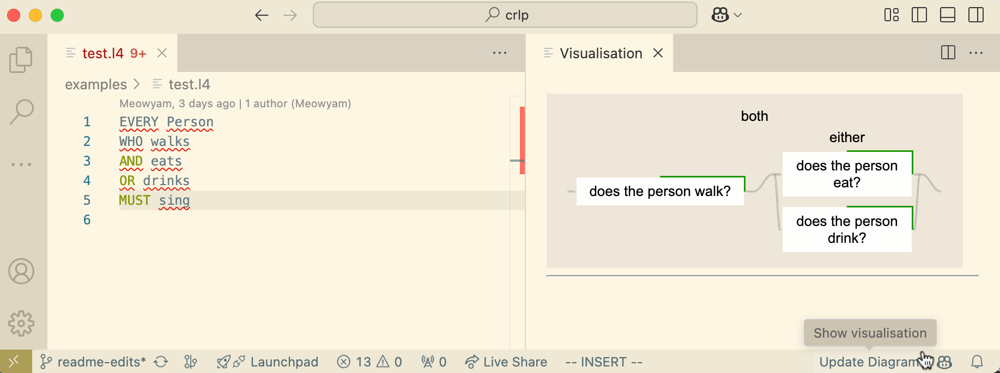

# crlp README

This is a prototype of a VSCode webview extension designed to visualize L4 programs as ladder diagrams.

## Running the Extension

1. Build the project

    ```bash
    npm run build 
    ```

2. Package the extension

    ```bash
    vsce package
    ```

    During this process, you may be prompted to create the package without a license. Confirm by responding `y` to proceed.
    

3. Install the extension
   The extension will be packaged as `crlp-0.0.1.vsix`. Open VSCode, select the *Install from VSIX* option, and install the file.
   
   > Note: After installation, the extension might initially appear inactive. To activate it, load or write an L4 rule (see details below).

## Features and Functionalities

### Ladder Diagram

The extension uses a VSCode webview to render L4 rules as ladder diagrams, displaying them in a panel next to the editor. This setup enables the extension to update the visualisation dynamically, reflecting any changes made to the rules in real time.

The ladder diagrams are powered by an npm library developed by Jules and Zeming, available [here](https://github.com/JuliaPoo/ladder-diagram). For integration within the extension, this library has been bundled using esbuild. To update the bundled file in the future, run:

```bash
npx esbuild node_modules/ladder-diagram/js/ladder.js --bundle --format=iife --global-name=LadderDiagram --outfile=media/ladder-diagram.min.js
```

The bundled file `ladder-diagram.min.js` will be located in the `media` folder. Direct imports of the ladder diagram library are not currently supported, so it is bundled with esbuild.

### L4 Rule Parsing

The extension accepts a subset of L4 rules for this demo. The recommended format is:

```l4
EVERY Person
WHO walks
AND eats
OR drinks
MUST sing
```



You can find an example file, `examples/test.l4`, in the repository. The current demo supports only variations of this specific rule format:

```l4
EVERY <noun>
WHO <verb1>
AND <verb2>
MUST <verb3>
```

> Note: Deviations from this format will result in an "Invalid rule format" error due to the temporary TypeScript-based parser (rule2Json.ts) used for this demo.

### Displaying the Diagram

To visualize your rule as a ladder diagram:

- Save the file containing your rule.

- Alternatively, use the "Update Diagram" button in the bottom-right status bar of VSCode (near the notification bell or Prettier controls). Clicking this button generates the diagram in a new panel.


## Limitations and Known Issues

The parser supports only a rigid subset of L4 rules, as detailed above.

Diagram updates require manual actions (saving the file or clicking the status bar button).

## Future Work

Backend Integration: The demo will eventually include a backend to support a broader range of L4 rules.

Diagram Interactivity: Future updates will allow users to interact directly with ladder diagrams within the extension.

## Release Notes

### 1.0.0

Initial release of a demo.
